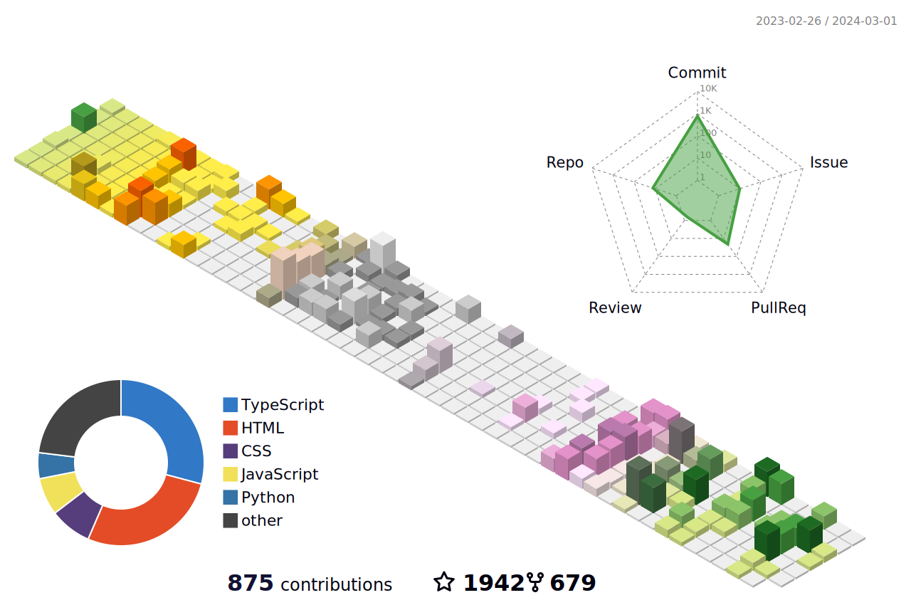
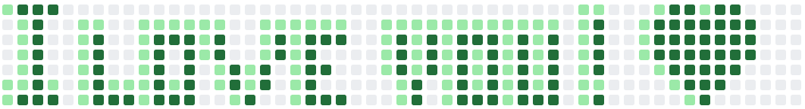

<!--    -->


<!--   my-icons -->
<p align="center">
    <a href="https://github.com/LucasLOOT/LucasLOOT/stargazers"></a>&emsp;&emsp;
    <a href="https://github.com/LucasLOOT/LucasLOOT/network/members"></a>
    <br><br>
<!-- -->
    <a href="https://github.com/LucasLOOT/LucasLOOT"></a>
    
    <a href="https://github.com/LucasLOOT/LucasLOOT/graphs/contributors"></a>
    
    <br><br>
<!-- -->
    <a href=""></a>&emsp;
    <a href=""></a>&emsp;
    <a href="https://space.bilibili.com/1158350144"></a>&emsp;
    <a href="https://blog.csdn.net/m0_64076751"></a>&emsp;
    <a href="https://www.zhihu.com/people/Destiny"></a>&emsp;

</p>

<!--   my-header-img -->


<!--   my-ticker -->    
[](https://git.io/typing-svg)


<!--   my-kaggle     
### My achievements on [kaggle](https://www.kaggle.com/andrej0marinchenko):


-->


<!--   my-skils -->

| Property                                        | Data                                                                                                                                                                                                                                                                                                                                                                                                                                                                                                                                                                                                                                                                                                                                                                                         |
|-------------------------------------------------|-----------------------------------------------------------------------------------------------------------------------------------------------------------------------------------------------------------------------------------------------------------------------------------------------------------------------------------------------------------------------------------------------------------------------------------------------------------------------------------------------------------------------------------------------------------------------------------------------------------------------------------------------------------------------------------------------------------------------------------------------------------------------------------------------------------------------------------------------------------------------------------------------------------------------------------------------------------------------------------------------------------------------------------------------------------------------------------------------------------------------------------------------------------------------------------------------------------------------------------------------------------------------------------------------------------------------------------------------------------------------------------------------------------------------------------------------------------------------------------------------------------------------------------------------------------------------------------------------------------------------------------------------------------------------------------------------------------------------------------------------------------------------------------------------------------------|
| **Language / IDE**                              |  &emsp;   &emsp;                                                                                                                                                                                                                                                                                                                                                                                                                                                                                                                                                                                                                                                                                                                                                                                                                                                                                                                                                                              |
| **Domain Knownledge**                           |  [](https://github.com/search?q=user%3ALucasLOOT&type=Repositories)&emsp;  [](https://github.com/LucasLOOT/LucasLOOT) &emsp;[](https://github.com/search?q=user%3ALucasLOOT&type=Repositories)&emsp; [-4C8CBF?style=flat&logoColor=white)](https://github.com/search?q=user%3ALucasLOOT&type=Repositories)                                                                                                                                                                                                                                                                                                                                                                                                                                                                                                                                                                                                                                                                                                                                   |
| **CI / CD**                                     | [](https://github.com/LucasLOOT/LucasLOOT)&emsp;  [](https://github.com/LucasLOOT/LucasLOOT) &emsp; [](https://github.com/LucasLOOT/LucasLOOT)                                                                                                                                                                                                                                                                                                                                                                                                                                                                                                                                                                                                                                                                                                                                                                                                                                                                                                                                                                                                                                                                                                                                                                                                                                                                                                                                                                                                                                                                                                                                                                    |
                                                                                                                                                                                                                                                                                                                        
<!--   GitHub stats graph -->
<br><br>
<!-- -->


| .                                                                                                                                       | .                                                                                                                         |
|-----------------------------------------------------------------------------------------------------------------------------------------|---------------------------------------------------------------------------------------------------------------------------|
|  |  |

<br><br>
<!-- -->


<div align="center">
    
</div>

<!-- Wakatime Graph-->
<table>
  <tr>
    <td></td>
    <td></td>
  </tr>
</table>


<!--   profile-green-animate -->


<!--   skyline -->
<a href="https://skyline.github.com/lucasloot/2023"></a>

<!-- [](https://skyline.github.com/lucasloot/2023) -->

<!--  2d history skills -->
</img>


**📫 How to Reach me:**
<!-- <p align="left">
<a href="https://twitter.com/lootCelestial" target="blank"></a>
<a href="https://www.linkedin.com/in/celestial-loot-75a4052b6/" target="blank"></a>
<a href="precelestialloot@gmail.com" target="blank"></a>
<a href="https://api.whatsapp.com/send?phone=" alt="Connect on Whatsapp">  </a>
</p> -->

<div align="center">
<summary>Trophy: Github Profile Trophy</summary>
</div>

<p align="center"> 
<a href="https://github.com/ryo-ma/github-profile-trophy"></a>
</p>


<div align="center">
<summary>Trophy: Hackerrank Profile Trophy</summary>
</div>

<p align="center"> 
 
</p>


<!--  -->


```geojson
{
 "type": "FeatureCollection",
 "features": [
   {
     "type": "Feature",
     "id": 1,
     "properties": {
       "ID": 0
     },
     "geometry": {
       "type": "Polygon",
       "coordinates": [
         [
           [120.85, 31.41],  
           [121.89, 31.41], 
           [121.89, 30.67],
           [120.85, 30.67], 
           [120.85, 31.41] 
         ]
       ]
     }
   }
 ]
}
``` 

<!-- <p align="center"> 


</p> 
-->


#### Thanks for visiting :heart:

<p align="center"> 
  

counting of visitors to this page in this section started from March 2, 2024
<!-- <a href="http://s01.flagcounter.com/more/ap7"></a> -->

<a href="https://info.flagcounter.com/Xz2O"></a>

## Star History

[](https://star-history.com/#LucasLOOT/LucasLOOT&Date)


### Profile Views

counting of visitors to this page in this section started from March 2, 2024


</br>


counting of visitors to all page in this section started from March 2, 2024


<br>


[MIT](LICENSE)


</p>


Initial drawing  `I love you`:
